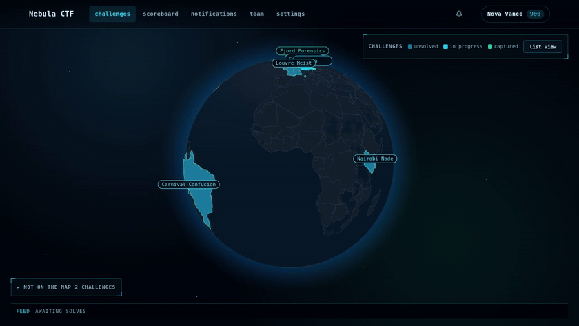
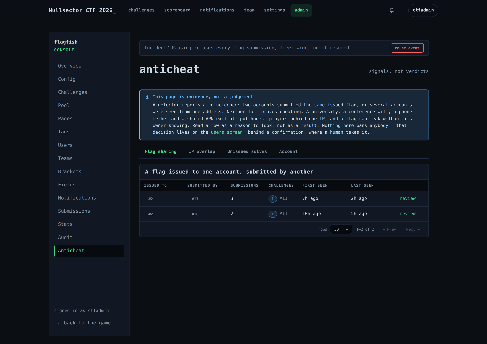
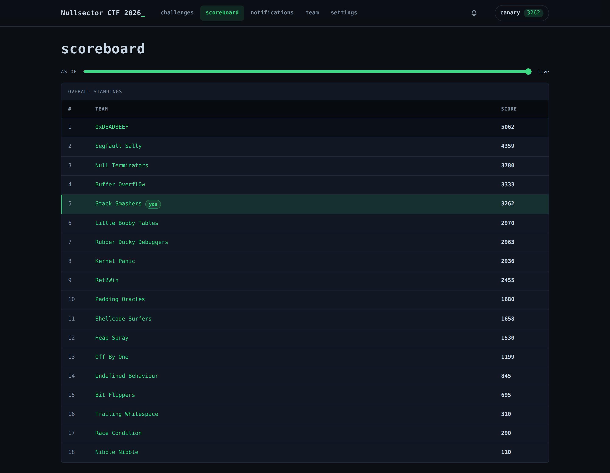
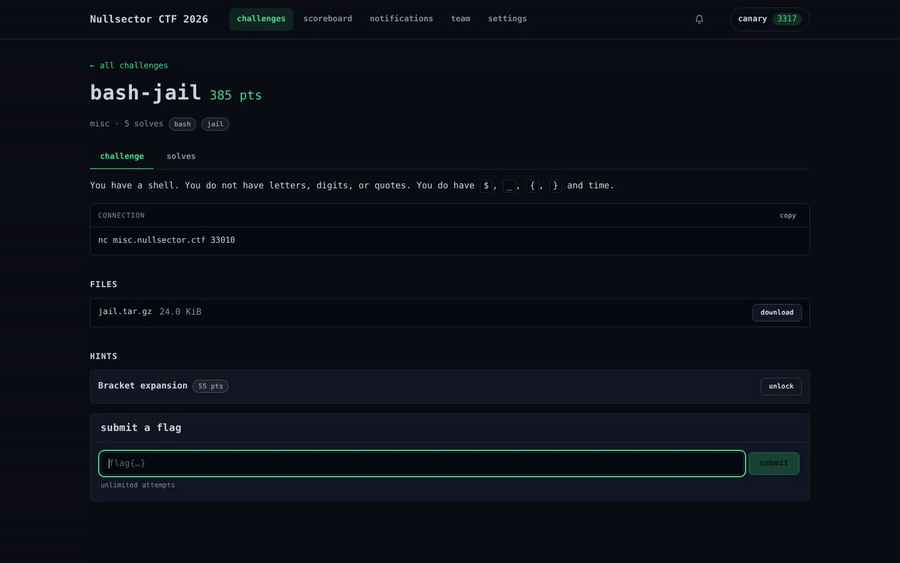
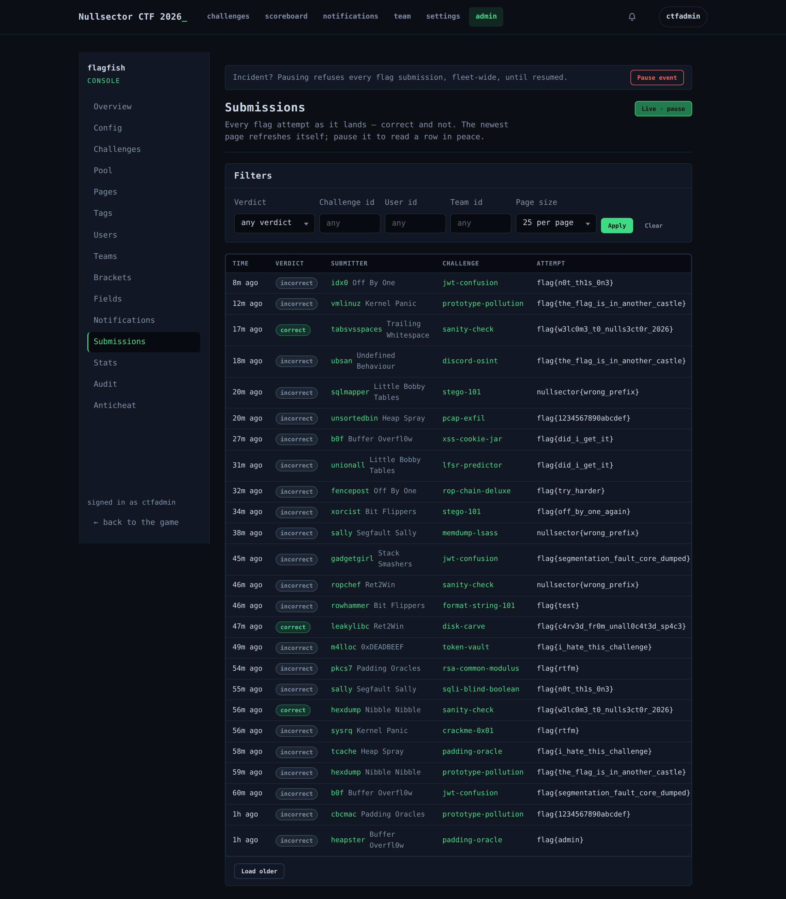
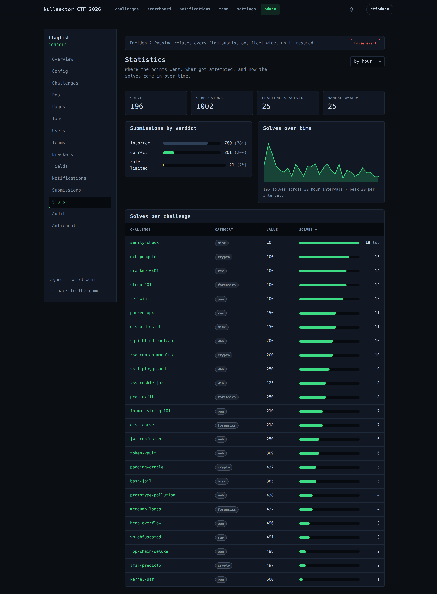

<div align="center">

# 🐟 flagfish

### The CTF platform that can *prove* things.

Provable anti-cheat, a scoreboard you can rewind to any moment, and correctness tested against real Postgres.

[](LICENSE)
[](go.mod)
[](docs/adr/0003-postgres-only-no-redis.md)
[](#status)



</div>

## 🎯 Catch flag sharing with *proof*

**Every other platform gives you a hunch. flagfish gives you a database row.** Unique per-team flags mean every solve is stamped with the team the flag was issued to — so "Team B submitted Team A's flag" is `attributed_account_id <> account_id`, not an argument you have to win. Detection is silent, so the cheater never learns to adapt. [How it works →](docs/why-flagfish.md#anti-cheat)

<div align="center"><a href="docs/assets/anticheat.png"></a></div>

## ⏪ Rewind the scoreboard to any moment

**Scores are stamped when they're earned, never recomputed on read.** The board at any past instant is a query, not a reconstruction — which gets you an exact freeze, exact final standings, and an animated replay of the entire event for free. [How it works →](docs/why-flagfish.md#time-travel)

<div align="center"><a href="docs/assets/scoreboard.png"></a></div>

## 🔒 Correct when a thousand people hit submit at once

**The hard bugs in a CTF are races — and flagfish backs every one with a database constraint, not a Go mutex, then proves it against real Postgres.**

```
100 goroutines submit the same flag   →  exactly one solve
100 goroutines race a first blood      →  exactly one winner
wrong answers (≈99% of submissions)    →  zero challenge locks taken
```

A mutex fixes one process; a constraint fixes all of them, forever. [The 24 races we test →](docs/why-flagfish.md#concurrency)

<div align="center"></div>

## 🌍 A board worth putting on the projector

**The challenge board is a view the organizer picks — and the built-in alternate is a WebGL globe.** Challenges live in countries; solve everything in one and your team captures it. Rival solves and first bloods pulse on the map live, and the globe brings its own dark ops-center skin to the whole portal while it leads. The plain list stays one click away for every player, and a browser without WebGL falls back to it automatically. [The design →](docs/adr/0009-annotations-and-portal-views.md)

## 🛠️ Everything an organizer needs, already built

A 17-screen admin console with no placeholders — live submissions, statistics, manual awards, a one-click pause switch, unique-flag pools, brackets, a markdown CMS, anti-cheat dossiers, and backup / restore / CTFd-import over HTTP.

<div align="center">
<a href="docs/assets/admin-submissions.png"></a>&nbsp;
<a href="docs/assets/admin-stats.png"></a>
</div>

| Gameplay | Run the event | Operate it |
|---|---|---|
| Users & teams mode | Live submissions + stats | `/metrics` + `/readyz` |
| Dynamic + static scoring | Manual awards & penalties | Real-time SSE |
| Per-account unique flags | One-click pause switch | OpenAPI 3.1 + RFC 7807 |
| First blood, hints, prereqs | Anti-cheat dossiers | Argon2id auth, API tokens |
| Freeze, brackets, `?as_of=` | Backup / restore / import | Trigger-based audit trail |

## Quickstart

```console
$ cp deploy/.env.example deploy/.env      # set your secrets
$ task deploy-up                           # flagfish + Postgres + MinIO  →  http://localhost:8000
$ flagfish admin create --email you@example.com   # instance live + first admin, in one step
```

Full runbook, TLS, and backups: **[deploy guide →](docs/ops/deploy.md)** · every knob: **[configuration →](docs/ops/environment.md)**

## Status

**Pre-1.0, and honest about it.** Feature-complete for a jeopardy CTF and heavily tested — the invariant, concurrency, and authorization suites all run against real Postgres on every change. What it doesn't have yet: a tagged release, a stable-API promise, or a real event behind it.

**No CTF has been run on flagfish — be the first.** Great for a small or internal competition today; for a marquee event with prize money, wait for 1.0.

## Docs & design

Every stack choice has an [ADR](docs/adr/) explaining what it cost, and the long-form design lives in [`docs/design/`](docs/design/). New here? Start with **[Why flagfish](docs/why-flagfish.md)**.

## License

[Apache-2.0](LICENSE), with an explicit patent grant. Contributions welcome — see [CONTRIBUTING.md](CONTRIBUTING.md); security reports go to [SECURITY.md](SECURITY.md).
